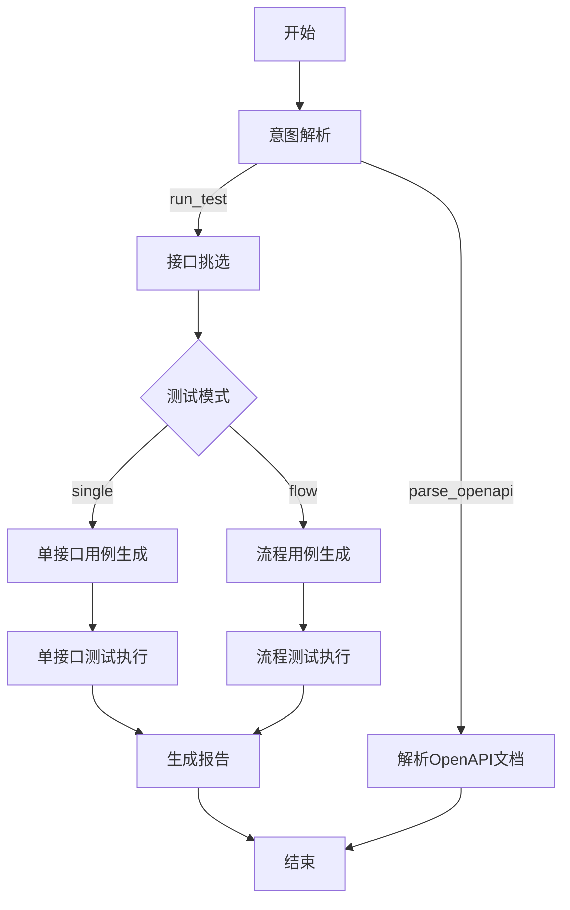
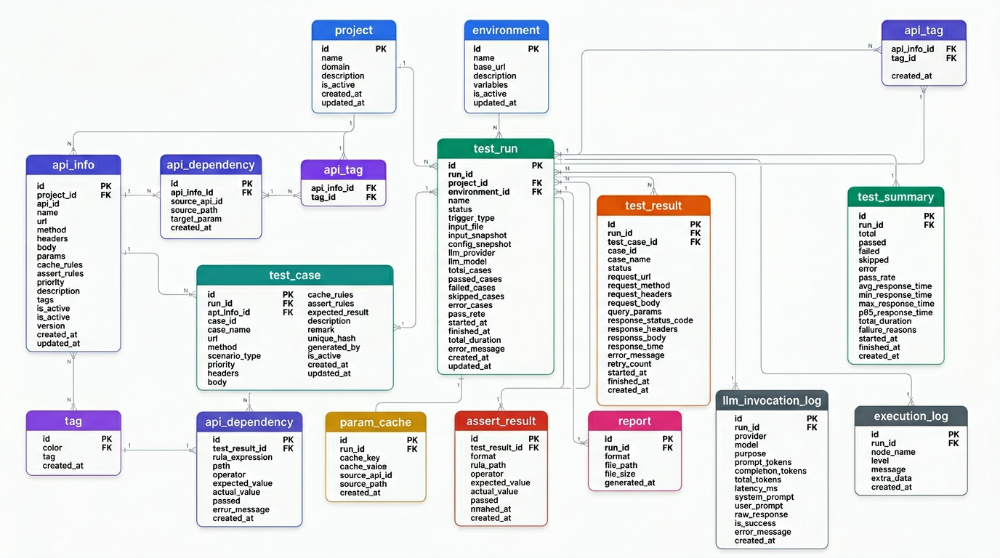

<div align="center">

<p align="center">
  <span style="font-size: 2em; font-weight: bold; vertical-align: middle;">LLMTestAgent</span>
</p>


**基于大模型的 API 自动化测试智能体**

面向多接口与依赖场景，串联「解析 → 用例生成 → 执行 → 报告」全流程，减少手工编排与重复劳动。

[快速开始](#快速开始) · [数据库初始化](#数据库初始化) · [配置说明](#配置说明) · [使用示例](#使用示例) · [常见问题](#常见问题)

</div>

---

## 主要功能

- 支持多模型提供商：`OpenAI` / `AWS Bedrock` / `智谱 GLM` / `通义千问`
- 基于 LangGraph 的有状态工作流编排，支持意图识别与自动路由
- 支持 OpenAPI 3.x 文档解析（JSON / YAML），自动提取接口信息并存储
- LLM 驱动的测试用例生成（单接口模式 + 流程模式）
- 测试执行支持依赖拓扑排序、并发执行、动态参数注入（`{{dep:...}}`）
- 内置断言引擎，支持 JSONPath 表达式断言
- 报告支持 `Excel` / `HTML` 双格式输出
- HTML 报告支持双层折叠：按接口分组 → 按用例展开详情
- 全流程数据持久化（SQLite），支持测试历史追溯与统计分析

---

## 架构概览



---

## 项目结构

```text
LLMTestAgent/
├── main.py                          # 主入口
├── config/
│   └── config.yaml                  # 应用配置文件
├── db/
│   └── LLMTest.db                   # SQLite 数据库（首次运行自动创建）
├── doc/
│   ├── SystemFlowchart.png          # 系统流程图
│   ├── ER.png                       # 数据库 ER 图
│   └── LLMTestAgent_数据库说明文档.docx
├── input/                           # OpenAPI 文档输入目录
│   ├── httpbin_service.json         # 示例：httpbin OpenAPI 3.1
│   └── panji.yaml                   # 示例：业务系统 OpenAPI 3.0
├── output/                          # 测试输出目录（自动创建）
│   └── <timestamp>/
│       ├── test_cases/              # 生成的测试用例
│       └── reports/                 # 测试报告（Excel/HTML）
├── src/
│   ├── __init__.py                  # 包入口，版本信息
│   ├── core/
│   │   ├── config.py                # 配置加载与管理
│   │   ├── database/
│   │   │   └── connection.py        # 数据库连接管理器（单例）
│   │   ├── llm/
│   │   │   └── llm_client.py        # LLM 统一客户端
│   │   ├── cache/                   # 缓存模块
│   │   └── logging/                 # 结构化日志（structlog）
│   ├── data/
│   │   ├── migration/
│   │   │   └── migration.py         # 数据库建表与迁移
│   │   ├── models/                  # SQLAlchemy ORM 模型
│   │   ├── repositories/            # 数据仓储层
│   │   ├── schemas/                 # Pydantic 数据校验
│   │   └── services/                # 业务逻辑服务层
│   ├── graph/
│   │   ├── state.py                 # LangGraph 状态定义
│   │   ├── route.py                 # 条件路由函数
│   │   ├── api_doc_storage.py       # OpenAPI 文档解析与存储
│   │   ├── executor/                # 测试执行引擎
│   │   │   ├── test_executor.py     # HTTP 请求执行
│   │   │   ├── assertion_engine.py  # 断言引擎
│   │   │   └── cache_resolver.py    # 依赖缓存解析
│   │   ├── nodes/                   # 工作流节点实现
│   │   └── tools/                   # LangGraph Agent 工具
│   ├── prompts/                     # LLM 提示词模板
│   ├── utils/                       # 通用工具（HTTP、解析器）
│   └── workflow.py                  # LangGraph 工作流编排
├── .env.example                     # 环境变量模板
├── requirements.txt                 # Python 依赖清单
└── README.md
```

---

## 环境要求

| 项目 | 要求 |
|------|------|
| Python | 3.10+ |
| 操作系统 | Windows / macOS / Linux |
| LLM 凭证 | 至少配置一个提供商的 API 密钥 |

---

## 快速开始

### 1. 克隆项目

```bash
git clone <repository-url>
cd LLMTestAgent
```

### 2. 创建虚拟环境（推荐）

```bash
python -m venv .venv

# Windows
.venv\Scripts\activate

# macOS / Linux
source .venv/bin/activate
```

### 3. 安装依赖

```bash
pip install -r requirements.txt
```

### 4. 配置环境变量

```bash
cp .env.example .env
```

编辑 `.env` 文件，填入实际的 API 密钥：

```dotenv
# 根据使用的提供商填写对应密钥

# AWS Bedrock（推荐）
AWS_ACCESS_KEY_ID=your-access-key-id
AWS_SECRET_ACCESS_KEY=your-secret-access-key
AWS_SESSION_TOKEN=your-session-token

# OpenAI
OPENAI_API_KEY=your-openai-api-key

# 智谱 AI
ZHIPU_API_KEY=your-zhipu-api-key

# 通义千问
DASHSCOPE_API_KEY=your-dashscope-api-key
```

### 5. 初始化数据库

参见下方 [数据库初始化](#数据库初始化) 章节。

### 6. 运行

```bash
# 解析 OpenAPI 文档并存储到数据库
python main.py "解析这份API文档并存储" --api-doc input/httpbin_service.json

# 对已存储的接口执行测试
python main.py "对用户模块执行单接口测试" --api-doc input/httpbin_service.json
```

---

## 数据库初始化

本项目使用 SQLite 作为数据持久化方案，通过 SQLAlchemy ORM 管理表结构。

### 自动初始化（推荐）

**首次运行 `main.py` 时，系统会自动完成以下步骤：**

1. 读取 `config/config.yaml` 中的 `database.url` 配置
2. 自动创建数据库文件所在目录（如 `db/`）
3. 自动创建 SQLite 数据库文件（如 `db/LLMTest.db`）
4. 通过 ORM 模型自动建表（所有预期的表和视图）

因此，**大多数情况下你无需手动创建数据库文件**，直接运行程序即可。

### 手动初始化

如果需要提前初始化数据库（例如在部署环境中），可以使用 Python 脚本：

```python
from src.core.config import init_config
from src.core.database.connection import init_database_from_config
from src.data.migration.migration import init_database_from_orm

# 加载配置
config = init_config()

# 初始化数据库连接（自动创建目录和 .db 文件）
manager = init_database_from_config(config)

# 通过 ORM 模型建表
init_database_from_orm(manager)

print("数据库初始化完成")
```

或使用一站式便捷函数：

```python
from src.data.migration.migration import ensure_database

# 自动完成连接初始化 + 建表（表已存在则跳过）
manager = ensure_database(db_url="sqlite:///db/LLMTest.db")
```

### 数据库配置

在 `config/config.yaml` 中配置数据库参数：

```yaml
database:
  url: "sqlite:///db/LLMTest.db"   # 数据库连接 URL
  echo: false                       # 是否在日志中打印 SQL 语句
  pool_size: 5                      # 连接池大小（SQLite 下忽略）
  max_overflow: 10                  # 最大溢出连接数（SQLite 下忽略）
  pool_timeout: 30                  # 连接池获取超时（秒）
  pool_recycle: 3600                # 连接回收时间（秒）
```

> **注意**：`url` 中的路径支持相对路径和绝对路径。相对路径相对于项目根目录。

### 数据库表结构

初始化后将创建以下表：

| 表名 | 说明 |
|------|------|
| `project` | 项目信息 |
| `environment` | 测试环境配置 |
| `api_info` | API 接口信息 |
| `api_dependency` | 接口依赖关系 |
| `tag` / `api_tag` | 接口标签 |
| `test_run` | 测试运行记录 |
| `test_case` | 测试用例 |
| `test_result` | 测试结果 |
| `assert_result` | 断言结果 |
| `test_summary` | 测试汇总统计 |
| `param_cache` | 参数缓存（依赖注入） |
| `report` | 测试报告记录 |
| `llm_invocation_log` | LLM 调用日志 |
| `execution_log` | 执行日志 |

同时会创建分析视图：`v_run_overview`、`v_api_pass_rate`、`v_scenario_distribution`、`v_top_failed_assertions`、`v_llm_usage_stats`。

### 重置数据库

如需重置数据库（清空所有数据），删除 `db/LLMTest.db` 文件后重新运行程序即可：

```bash
# Windows
del db\LLMTest.db

# macOS / Linux
rm db/LLMTest.db

# 重新运行，自动重建
python main.py "解析这份API文档" --api-doc input/httpbin_service.json
```

### ER 图



---

## 配置说明

配置文件位于 `config/config.yaml`，支持通过 `${ENV_VAR}` 语法引用环境变量。

### LLM 配置

| 配置路径 | 说明 | 可选值 |
|----------|------|--------|
| `llm.provider` | LLM 提供商 | `openai` / `bedrock` / `zhipu` / `qwen` |
| `llm.openai.api_key` | OpenAI API 密钥 | `${OPENAI_API_KEY}` |
| `llm.openai.model` | 模型名称 | `gpt-4` |
| `llm.bedrock.region` | AWS 区域 | `us-east-1` |
| `llm.bedrock.model_id` | Bedrock 模型 ID | `us.anthropic.claude-opus-4-5-20251101-v1:0` |
| `llm.bedrock.max_tokens` | 最大输出 token | `4096` |
| `llm.bedrock.access_key` | AWS Access Key | `${AWS_ACCESS_KEY_ID}` |
| `llm.bedrock.secret_key` | AWS Secret Key | `${AWS_SECRET_ACCESS_KEY}` |
| `llm.bedrock.session_token` | AWS Session Token | `${AWS_SESSION_TOKEN}` |
| `llm.zhipu.api_key` | 智谱 API 密钥 | `${ZHIPU_API_KEY}` |
| `llm.qwen.api_key` | 通义千问 API 密钥 | `${DASHSCOPE_API_KEY}` |

### 测试执行配置

| 配置路径 | 说明 | 默认值 |
|----------|------|--------|
| `execution.connect_timeout` | 连接超时（秒） | `5` |
| `execution.read_timeout` | 读取超时（秒） | `30` |
| `execution.total_timeout` | 总超时（秒） | `60` |
| `execution.retry.max_retries` | 最大重试次数 | `2` |
| `execution.retry.retry_interval` | 重试间隔（秒） | `1` |
| `execution.retry.retry_on_status` | 触发重试的状态码 | `[500, 502, 503, 504]` |
| `execution.concurrency.enabled` | 启用并发执行 | `true` |
| `execution.concurrency.max_workers` | 最大并发数 | `5` |
| `execution.dependency_failure` | 依赖失败处理策略 | `skip`（可选 `abort`） |

### 数据库配置

| 配置路径 | 说明 | 默认值 |
|----------|------|--------|
| `database.url` | 数据库连接 URL | `sqlite:///db/LLMTest.db` |
| `database.echo` | 打印 SQL 日志 | `false` |
| `database.pool_size` | 连接池大小 | `5` |
| `database.pool_recycle` | 连接回收周期（秒） | `3600` |

### 日志配置

| 配置路径 | 说明 | 默认值 |
|----------|------|--------|
| `logging.level` | 日志级别 | `INFO` |
| `logging.format` | 输出格式 | `console`（可选 `json`） |

### Bedrock 配置示例（推荐）

```yaml
llm:
  provider: bedrock
  bedrock:
    region: us-east-1
    model_id: us.anthropic.claude-opus-4-5-20251101-v1:0
    max_tokens: 4096
    access_key: ${AWS_ACCESS_KEY_ID}
    secret_key: ${AWS_SECRET_ACCESS_KEY}
    session_token: ${AWS_SESSION_TOKEN}
```

> 使用 AWS 临时凭证（STS）时，`AWS_SESSION_TOKEN` 必填。

---

## 使用示例

### 命令行格式

```bash
python main.py "<自然语言指令>" [--api-doc <OpenAPI文档路径>] [--config <配置文件路径>]
```

| 参数 | 简写 | 说明 | 必填 |
|------|------|------|------|
| `instruction` | - | 自然语言指令（LLM 判断意图） | 是 |
| `--api-doc` | `-a` | OpenAPI 文档路径（YAML/JSON） | 否 |
| `--config` | `-c` | 配置文件路径（默认 `config/config.yaml`） | 否 |

### 示例命令

```bash
# 解析 OpenAPI 文档并存储到数据库
python main.py "解析这份API文档并存储" --api-doc input/httpbin_service.json

# 对指定文档中的接口执行单接口测试
python main.py "对所有接口执行单接口测试" --api-doc input/httpbin_service.json

# 执行流程测试（接口间有依赖关系）
python main.py "执行流程测试" --api-doc input/panji.yaml

# 指定自定义配置文件
python main.py "解析API文档" --api-doc input/httpbin_service.json --config config/custom.yaml
```

### 支持的意图

系统通过 LLM 自动识别用户指令的意图：

| 意图 | 触发关键词示例 | 行为 |
|------|---------------|------|
| `parse_openapi` | "解析文档"、"存储API" | 解析 OpenAPI 文档并存入数据库 |
| `run_test` | "执行测试"、"测试接口" | 挑选接口 → 生成用例 → 执行 → 出报告 |

### 支持的输入格式

- OpenAPI 3.0.x（YAML / JSON）
- OpenAPI 3.1.x（YAML / JSON）

---

## 测试报告

执行完成后，报告输出在 `output/<timestamp>/reports/` 目录下：

| 格式 | 说明 |
|------|------|
| Excel | 结构化结果清单，适合筛选与归档 |
| HTML | 可视化报告，支持折叠查看 |

HTML 报告支持双层折叠结构：
- 第 1 层：按接口分组折叠
- 第 2 层：按用例展开，包含完整的请求方法、请求地址、请求头、请求数据、响应码、响应头、响应数据、耗时、错误信息

---

## 工作流详解

本项目基于 [LangGraph](https://github.com/langchain-ai/langgraph) 实现有状态工作流。核心流程如下：

### 节点说明

| 节点 | 功能 |
|------|------|
| `start` | 验证输入，初始化状态 |
| `parse_input` | LLM 意图识别，确定测试模式 |
| `select_endpoints_agent` | Agent + Tool 循环挑选目标接口 |
| `generate_single_cases` | LLM 生成单接口测试用例 |
| `generate_flow_cases` | LLM 生成流程测试用例 |
| `execute_single_tests` | HTTP 执行 + 断言校验（单接口） |
| `execute_flow_tests` | 顺序执行 + 上下文传递（流程） |
| `generate_report` | 汇总结果，生成 Excel/HTML 报告 |
| `parse_openapi_doc` | 解析 OpenAPI 文档并持久化 |
| `error` | 错误处理与日志记录 |

### 路由逻辑

- **意图路由**：`parse_input` 节点通过 LLM 识别指令意图，路由到 `select_endpoints`（测试）或 `parse_openapi_doc`（文档解析）
- **模式路由**：根据测试模式（`single` / `flow`）路由到对应的用例生成节点
- **步骤路由**：每个节点通过 `current_step` 字段控制下一步走向，支持错误分支

---

## 常见问题

### 1. 数据库文件在哪里？如何创建？

数据库文件默认位于 `db/LLMTest.db`。**无需手动创建**，首次运行程序时会自动创建目录、文件和所有表结构。如果想要修改路径，编辑 `config/config.yaml` 中的 `database.url` 字段即可。

### 2. Bedrock 报错：`security token ... is invalid`

- 检查 `AWS_ACCESS_KEY_ID` / `AWS_SECRET_ACCESS_KEY` 是否正确
- 使用临时凭证时请确保设置了 `AWS_SESSION_TOKEN`
- 确认凭证是否已过期

### 3. Bedrock 报错：`Provider us model does not support chat`

- 项目已内置对 `us.` 前缀模型 ID 的兼容重试
- 建议更新依赖：`pip install -U langchain-aws`

### 4. LLM 调用失败后为什么不继续生成用例？

当前设计为：用例生成仅由 LLM 完成，失败会直接终止流程并进入错误节点，避免产生不可信测试数据。

### 5. 运行后没有生成报告文件？

- 查看终端输出或日志中是否有错误信息
- 确认输入的 OpenAPI 文档格式正确（支持 3.0.x / 3.1.x）
- 确认 LLM 凭证可用（尤其 Bedrock 的 AK/SK/Session Token）
- 确认数据库中已存储了接口数据（先运行"解析文档"指令）

### 6. 如何查看数据库中存储的数据？

使用任意 SQLite 客户端工具打开 `db/LLMTest.db` 文件：

```bash
# 命令行方式
sqlite3 db/LLMTest.db
.tables
SELECT * FROM project;

# 或使用 DB Browser for SQLite / DBeaver 等图形化工具
```

### 7. 如何切换 LLM 提供商？

修改 `config/config.yaml` 中的 `llm.provider` 字段，并确保对应提供商的密钥已在 `.env` 中配置：

```yaml
llm:
  provider: openai  # 可选: openai / bedrock / zhipu / qwen
```

---

## 开发指南

### 运行测试

```bash
# 运行全部测试
python -m unittest discover

# 运行单个测试模块
python -m unittest tests.test_module_name
```

### 数据库开发

数据库模型定义在 `src/data/models/` 目录下，修改模型后重新运行程序会自动创建新表（已存在的表不会被修改）。

如需变更已有表结构，可以：
1. 删除 `db/LLMTest.db` 文件重新建表（开发环境）
2. 使用 Alembic 进行数据库迁移（生产环境，依赖已包含在 requirements.txt 中）

### 添加新的工作流节点

1. 在 `src/graph/nodes/` 下创建节点函数
2. 在 `src/workflow.py` 中注册节点和边
3. 如需新的路由逻辑，在 `src/graph/route.py` 中添加

---

## 技术栈

| 组件 | 技术 |
|------|------|
| 工作流引擎 | LangGraph |
| LLM 框架 | LangChain |
| 数据库 ORM | SQLAlchemy 2.0 |
| 数据校验 | Pydantic 2.0 |
| HTTP 客户端 | httpx / requests |
| 日志 | structlog |
| 报告生成 | Jinja2 + openpyxl |
| 配置管理 | PyYAML + python-dotenv |

---

## License

This project is licensed under the [Apache License 2.0](LICENSE) open source license.
