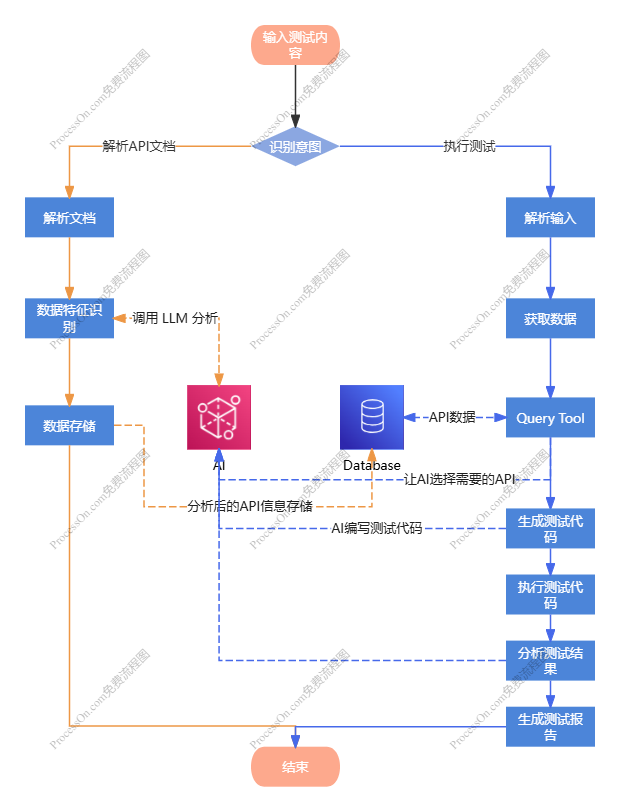

<div align="center">

<p align="center">
  <span style="font-size: 2em; font-weight: bold; vertical-align: middle;">LLMTestAgent</span>
</p>


**基于大模型的 API 自动化测试智能体**

面向多接口与依赖场景，串联「解析 → 用例生成 → 执行 → 报告」全流程，减少手工编排与重复劳动。

[English](README.md) • [快速命令](#快速命令) • [测试输入格式](#输入格式) • [常见问题](#常见问题)


</div>

---

## 主要功能

- 支持多模型：`OpenAI` / `AWS Bedrock` / `智谱` / `通义千问`
- 用例生成策略：**仅 LLM 生成**（失败即终止，不再使用兜底 mock）
- 支持接口依赖与动态参数注入（如 `{{dep:...}}`）
- 测试执行支持依赖拓扑排序与并发执行
- 报告支持 `Excel` / `HTML`
- HTML 报告支持双层折叠：
  - 按接口分组折叠
  - 按用例折叠详情
- 报告详情包含完整请求/响应字段：
  - 请求方法、请求地址、请求头、请求数据
  - 响应码、响应头、响应数据、耗时、错误信息

## 项目结构 <a id="项目结构"></a>

```text
LLMTestAgent/
├── main.py
├── config/
│   └── config.yaml
├── examples/
│   ├── input_example.json
│   └── run_example.py
├── src/
│   ├── core/
│   │   ├── config.py
│   │   └── models.py
│   ├── services/
│   │   ├── input_parser.py
│   │   ├── case_generator.py
│   │   ├── test_executor.py
│   │   ├── report_generator.py
│   │   ├── excel_exporter.py
│   │   └── llm_client.py
│   └── workflows/
│       └── workflow.py
├── tests/
├── requirements.txt
└── README.md
```

## 流程图


## 环境要求

- Python `3.10+`
- 推荐先创建虚拟环境

## 安装依赖

```bash
pip install -r requirements.txt
```

## 快速命令 <a id="快速命令"></a>

```bash
# 1) 安装依赖
pip install -r requirements.txt

# 2) 运行示例
python main.py --input input/input_example.json --output output/

# 3) 运行测试
python -m unittest
```

## 配置说明

配置文件：`config/config.yaml`

### 核心配置项（建议）

| 配置路径 | 说明 | 推荐值                                       |
|---|---|-------------------------------------------|
| `llm.provider` | 模型提供商 | `bedrock`                                 |
| `llm.bedrock.region` | Bedrock 区域 | `us-east-1`                               |
| `llm.bedrock.model_id` | 模型 ID | `us.anthropic.claude-opus-4-5-20251101-v1:0` |
| `llm.bedrock.max_tokens` | 最大输出 token | `4096`                                    |
| `execution.connect_timeout` | 连接超时（秒） | `5`                                       |
| `execution.read_timeout` | 读取超时（秒） | `30`                                      |
| `execution.concurrency.max_workers` | 并发数 | `5`                                       |
| `output.report.formats` | 报告格式 | `[excel, html]`                           |

### Bedrock 配置示例（推荐）

```yaml
llm:
  provider: bedrock
  bedrock:
    region: us-east-1
    model_id: us.anthropic.claude-opus-4-5-20251101-v1:0
    max_tokens: 4096
    access_key: ${AWS_ACCESS_KEY_ID}
    secret_key: ${AWS_SECRET_ACCESS_KEY}
    session_token: ${AWS_SESSION_TOKEN}
```

> 如果使用临时凭证（STS），`AWS_SESSION_TOKEN` 必填。

## 运行方式

```bash
python main.py --input input/input_example.json --output output/
```

执行完成后会在 `output/` 下生成：

- `output/test_cases/`：测试用例 Excel
- `output/reports/`：测试报告（Excel/Markdown/HTML）
- `output/logs/`：执行日志

## 报告说明

- `Excel`：结构化结果清单，适合筛选与归档
- `HTML`：可视化报告，支持折叠查看大量用例
  - 第 1 层：按接口分组
  - 第 2 层：按用例展开请求/响应详情

## 输入格式（简要） <a id="输入格式"></a>

```json
{
  "domain": "https://api.example.com",
  "apis": [
    {
      "name": "用户登录",
      "url": "/login",
      "method": "POST",
      "headers": { "Content-Type": "application/json" },
      "body": { "username": "testuser", "password": "testpass" },
      "assert_rules": ["$.code == 200", "$.data.token != null"],
      "priority": "P0"
    }
  ]
}
```

## 常见问题 <a id="常见问题"></a>

### 1) Bedrock 报错：`security token ... is invalid`

- 检查 `AWS_ACCESS_KEY_ID` / `AWS_SECRET_ACCESS_KEY`
- 使用临时凭证时请设置 `AWS_SESSION_TOKEN`

### 2) Bedrock 报错：`Provider us model does not support chat`

- 项目已内置对 `us.` 前缀模型 ID 的兼容重试
- 仍建议更新依赖：

```bash
pip install -U langchain-aws
```

### 3) LLM 调用失败后为什么不继续生成用例？

这是当前设计：用例生成改为仅 LLM 生成，失败会直接终止流程，避免产生不可信测试数据。

### 4) 运行后没有生成报告文件？

- 先查看 `output/logs/app.log` 中是否已有“用例生成异常”或“测试执行异常”
- 确认输入 JSON 中 `url`、`method`、`assert_rules` 格式正确
- 确认 LLM 凭证可用（尤其 Bedrock 的 AK/SK/Session Token）

## 开发与验证

```bash
# 运行全部测试
python -m unittest

# 运行单个测试模块（示例）
python -m unittest tests.test_report_details
python -m unittest tests.test_case_generator_no_fallback
```

## License

This project is licensed under the [Apache License 2.0](LICENSE) open source license.
