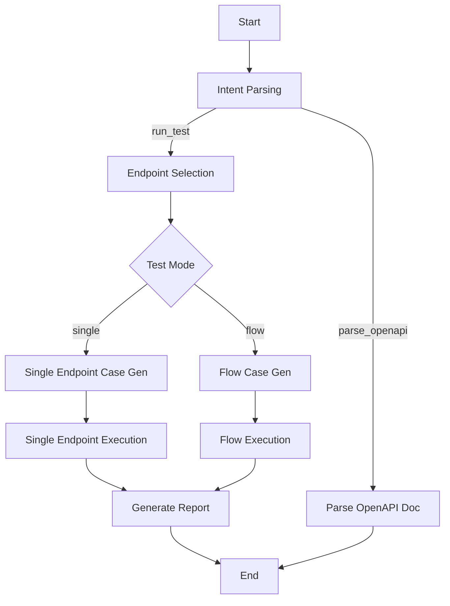

<div align="center">

<p align="center">
  <span style="font-size: 2em; font-weight: bold; vertical-align: middle;">LLMTestAgent</span>
</p>


**LLM-Driven API Automation Testing Agent**

Natural language powered, orchestrating the full pipeline: Parse → Generate → Execute → Report.

[Quick Start](#quick-start) · [Configuration](#configuration) · [Usage](#usage) · [Workflow](#workflow-details)

[中文](README_zh.md) | English

</div>

---

## Features

- Multi-model support: `OpenAI` / `AWS Bedrock` / `Zhipu GLM` / `Tongyi Qwen`
- Stateful workflow orchestration based on LangGraph with LLM-driven intent recognition and routing
- OpenAPI 3.x document parsing (JSON / YAML) with automatic endpoint extraction and persistence
- LLM-driven test case generation (single-endpoint mode + flow mode)
- Test execution with dependency topological sort, concurrent execution, and dynamic parameter injection (`{{dep:...}}`)
- Built-in assertion engine supporting JSONPath expressions
- HTML visual reports with collapsible endpoint groups and expandable case details
- Full pipeline data persistence (SQLite) for test history tracing and statistical analysis
- FastAPI RESTful API service for web-based triggering and management

---

## Architecture



---

## Quick Start

### 1. Clone and Install

```bash
git clone https://github.com/cmrhyq/LLMTestAgent.git
cd LLMTestAgent

python -m venv .venv
# Windows
.venv\Scripts\activate
# macOS / Linux
source .venv/bin/activate

pip install -r requirements.txt
```

### 2. Configure Environment Variables

```bash
cp .env.example .env
```

Edit `.env` and fill in the API keys for your LLM provider:

```dotenv
# AWS Bedrock (recommended)
AWS_ACCESS_KEY_ID=your-access-key-id
AWS_SECRET_ACCESS_KEY=your-secret-access-key
AWS_SESSION_TOKEN=your-session-token

# OpenAI
OPENAI_API_KEY=your-openai-api-key

# Zhipu AI
ZHIPU_API_KEY=your-zhipu-api-key

# Tongyi Qwen
DASHSCOPE_API_KEY=your-dashscope-api-key
```

### 3. Run

```bash
# Parse an OpenAPI document and store it in the database
python main.py "Parse this API document and store it" --api-doc input/httpbin_service.json

# Execute tests on stored endpoints
python main.py "Run single-endpoint tests on all endpoints" --api-doc input/httpbin_service.json
```

> On first run, the database (`db/LLMTest.db`) and all table schemas are created automatically — no manual initialization required.

---

## Project Structure

```text
LLMTestAgent/
├── main.py                          # CLI entry point
├── app.py                           # FastAPI web service entry
├── config/
│   └── config.yaml                  # Application config
├── db/
│   └── LLMTest.db                   # SQLite database (auto-created)
├── input/                           # OpenAPI document input directory
├── output/                          # Test report output directory
│   └── <timestamp>/reports/         # HTML test reports
├── src/
│   ├── workflow.py                  # LangGraph workflow orchestration
│   ├── api/                         # FastAPI route layer
│   ├── core/
│   │   ├── config.py                # Configuration loading
│   │   ├── database/                # Database connection management
│   │   ├── llm/                     # Unified LLM client
│   │   └── logging.py              # Structured logging
│   ├── data/
│   │   ├── models/                  # SQLAlchemy ORM models
│   │   ├── repositories/            # Data repository layer
│   │   ├── schemas/                 # Pydantic data validation
│   │   ├── services/                # Business logic services
│   │   └── migration/               # Database migrations
│   ├── graph/
│   │   ├── state.py                 # Workflow state definition
│   │   ├── route.py                 # Conditional routing functions
│   │   ├── nodes/                   # Workflow node implementations
│   │   ├── executor/                # Test execution engine
│   │   └── tools/                   # LangGraph Agent tools
│   ├── prompts/                     # Prompt templates (YAML)
│   └── utils/                       # Utilities (HTTP, parser, ID generation)
├── pyproject.toml                   # Project metadata and tool config
├── .env.example                     # Environment variable template
└── requirements.txt                 # Python dependencies
```

---

## Configuration

Config file: `config/config.yaml`, supports `${ENV_VAR}` syntax for referencing environment variables.

### Full Configuration Example

```yaml
llm:
  provider: bedrock                    # openai / bedrock / zhipu / qwen
  bedrock:
    region: us-east-1
    model_id: us.anthropic.claude-opus-4-5-20251101-v1:0
    max_tokens: 4096
    access_key: ${AWS_ACCESS_KEY_ID}
    secret_key: ${AWS_SECRET_ACCESS_KEY}
    session_token: ${AWS_SESSION_TOKEN}
  openai:
    api_key: ${OPENAI_API_KEY}
    model: gpt-4
  zhipu:
    api_key: ${ZHIPU_API_KEY}
  qwen:
    api_key: ${DASHSCOPE_API_KEY}

database:
  url: "sqlite:///db/LLMTest.db"
  echo: false
  pool_size: 5
  pool_recycle: 3600

execution:
  connect_timeout: 5
  read_timeout: 30
  total_timeout: 60
  retry:
    max_retries: 2
    retry_interval: 1
    retry_on_status: [500, 502, 503, 504]
  concurrency:
    enabled: true
    max_workers: 5
  dependency_failure: skip             # skip / abort

logging:
  level: INFO
  format: console                      # console / json

langsmith:
  enabled: false                       # set to true to enable LangSmith tracing
  api_key: ${LANGSMITH_API_KEY}
  project: LLMTestAgent
  endpoint: https://api.smith.langchain.com
```

---

## Usage

### CLI Mode

```bash
python main.py "<natural language instruction>" [--api-doc <path>] [--config <path>]
```

| Argument | Short | Description | Required |
|----------|-------|-------------|----------|
| `instruction` | - | Natural language instruction | Yes |
| `--api-doc` | `-a` | OpenAPI document path | No |
| `--config` | `-c` | Config file path | No |

```bash
# Parse document
python main.py "Parse this API document and store it" --api-doc input/httpbin_service.json

# Single-endpoint testing
python main.py "Run single-endpoint tests on all endpoints" --api-doc input/httpbin_service.json

# Flow testing (with inter-endpoint dependencies)
python main.py "Run flow tests" --api-doc input/panji.yaml
```

### Web API Mode (FastAPI)

```bash
python app.py
# or
uvicorn app:app --host 0.0.0.0 --port 8000 --reload
```

Visit http://localhost:8000/docs for the Swagger documentation after startup.

| Module | Path Prefix | Function |
|--------|-------------|----------|
| Projects | `/api/v1/projects` | Project CRUD |
| Endpoints | `/api/v1/endpoints` | Endpoint definition CRUD |
| Environments | `/api/v1/environments` | Environment config CRUD |
| Test Runs | `/api/v1/test-runs` | Execution history query |
| Workflows | `/api/v1/workflows` | Parse docs, trigger tests |

```bash
# Upload and parse an OpenAPI document
curl -X POST http://localhost:8000/api/v1/workflows/parse-openapi \
  -F "file=@input/httpbin_service.json"

# Trigger test execution
curl -X POST http://localhost:8000/api/v1/workflows/run-test \
  -H "Content-Type: application/json" \
  -d '{"instruction": "Run single-endpoint tests on all endpoints"}'
```

---

## Test Reports

After execution, HTML reports are output to `output/<timestamp>/reports/`.

Reports use a two-level collapsible structure:
- **Level 1**: Grouped by endpoint (collapsible)
- **Level 2**: Expanded by test case, including request method, URL, headers, body, status code, response data, latency, and error messages

---

## Workflow Details

Built on [LangGraph](https://github.com/langchain-ai/langgraph) StateGraph.

### Node Descriptions

| Node | Function |
|------|----------|
| `start` | Validate input, initialize state |
| `parse_input` | LLM intent recognition (`run_test` / `parse_openapi`) |
| `select_endpoints_agent` | Agent + Tool loop, autonomously queries DB to select target endpoints |
| `generate_single_cases` | LLM generates single-endpoint test cases |
| `generate_flow_cases` | LLM generates flow test cases (with dependencies) |
| `execute_single_tests` | HTTP execution + assertion validation |
| `execute_flow_tests` | Sequential execution + context passing |
| `generate_report` | Aggregate results, generate HTML report |
| `parse_openapi_doc` | Parse OpenAPI document and persist |

### Routing Logic

- **Intent routing**: `parse_input` → LLM identifies instruction intent → routes to test flow or document parsing
- **Mode routing**: Routes to corresponding branch based on test mode (`single` / `flow`)
- **Step routing**: Each node controls flow via `current_step`; exceptions route to `error` node

---

## Database

Uses SQLite + SQLAlchemy ORM. Database and tables are created automatically on first run.

### Core Tables

| Table | Description |
|-------|-------------|
| `project` | Project information |
| `environment` | Test environment configuration |
| `api_info` | API endpoint information |
| `api_dependency` | Endpoint dependency relationships |
| `test_run` | Test run records |
| `test_case` | Test cases |
| `test_result` | Test results |
| `test_summary` | Test summary statistics |
| `report` | Report records |

### Reset Database

```bash
# Delete and re-run to rebuild
del db\LLMTest.db          # Windows
rm db/LLMTest.db           # macOS / Linux
```

### ER Diagram

See [Database ER Diagram](doc/ER.md) (PlantUML + SVG) and [Database Design Document](doc/DatabaseDesign.md).

---

## Development

### Run Tests

```bash
pytest
# or with coverage
pytest --cov=src --cov-report=html
```

### Add a Workflow Node

1. Create a node function in `src/graph/nodes/`
2. Register the node and edges in `src/workflow.py`
3. If routing logic is needed, add it to `src/graph/route.py`

### Database Changes

Models are defined in `src/data/models/`. After modification, delete the `.db` file and re-run to rebuild (development). For production, use Alembic migrations.

---

## Tech Stack

| Component | Technology |
|-----------|------------|
| Workflow Engine | LangGraph |
| LLM Framework | LangChain |
| Observability | LangSmith (optional) |
| Web Framework | FastAPI + Uvicorn |
| Database ORM | SQLAlchemy 2.0 |
| Data Validation | Pydantic 2.0 |
| HTTP Client | httpx |
| Logging | structlog |
| Report Generation | Jinja2 (HTML templates) |
| Configuration | PyYAML + python-dotenv |

---

## LangSmith Observability (Optional)

The project supports [LangSmith](https://smith.langchain.com/) tracing. When enabled, all LangChain/LangGraph calls (LLM requests, tool invocations, node transitions) are automatically reported to the LangSmith platform for debugging and performance analysis.

### Enable

1. Fill in the API key in `.env`:

```dotenv
LANGSMITH_API_KEY=your-langsmith-api-key
```

2. Enable in `config/config.yaml`:

```yaml
langsmith:
  enabled: true
  api_key: ${LANGSMITH_API_KEY}
  project: LLMTestAgent              # Project name in LangSmith
  endpoint: https://api.smith.langchain.com
```

### Disable

Set `langsmith.enabled` to `false` (default) — no network requests or performance overhead will occur.

---

## FAQ

**Where is the database file?** Default `db/LLMTest.db`, created automatically on first run. Modify the path in `config/config.yaml` under `database.url`.

**Bedrock error `security token is invalid`?** Verify your AK/SK are correct; when using temporary credentials ensure `AWS_SESSION_TOKEN` is set; confirm credentials haven't expired.

**How to switch LLM provider?** Change `llm.provider` in `config/config.yaml` to `openai` / `bedrock` / `zhipu` / `qwen`, and ensure the corresponding API keys are configured.

**No report generated after running?** Verify the OpenAPI document format is correct (3.0.x / 3.1.x), LLM credentials are valid, and the database contains endpoint data (run the "parse document" instruction first).

**How to enable LangSmith tracing?** Set `langsmith.enabled: true` in `config/config.yaml` and fill in `LANGSMITH_API_KEY` in `.env`. Once enabled, no business code changes are needed — the LangChain SDK automatically reports tracing data.

---

## License

This project is licensed under the [Apache License 2.0](LICENSE).
