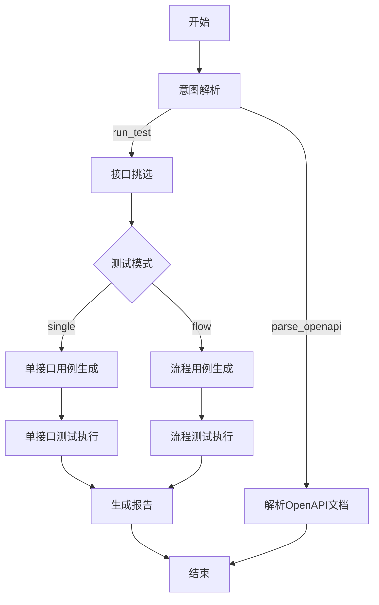

<div align="center">

<p align="center">
  <span style="font-size: 2em; font-weight: bold; vertical-align: middle;">LLMTestAgent</span>
</p>


**基于大模型的 API 自动化测试智能体**

自然语言驱动，串联「解析 → 用例生成 → 执行 → 报告」全流程。

[快速开始](#快速开始) · [配置说明](#配置说明) · [使用示例](#使用示例) · [工作流详解](#工作流详解)

中文 | [English](README.md)

</div>

---

## 主要功能

- 多模型支持：`OpenAI` / `AWS Bedrock` / `智谱 GLM` / `通义千问`
- 基于 LangGraph 的有状态工作流编排，LLM 自动识别意图并路由
- OpenAPI 3.x 文档解析（JSON / YAML），自动提取接口信息并持久化
- LLM 驱动测试用例生成（单接口模式 + 流程模式）
- 测试执行支持依赖拓扑排序、并发执行、动态参数注入（`{{dep:...}}`）
- 内置断言引擎，支持 JSONPath 表达式断言
- HTML 可视化报告，支持按接口分组折叠、按用例展开详情
- 全流程数据持久化（SQLite），支持测试历史追溯与统计分析
- 提供 FastAPI RESTful API 服务，支持 Web 端触发与管理

---

## 架构概览



---

## 快速开始

### 1. 克隆并安装

```bash
git clone https://github.com/cmrhyq/LLMTestAgent.git
cd LLMTestAgent

python -m venv .venv
# Windows
.venv\Scripts\activate
# macOS / Linux
source .venv/bin/activate

pip install -r requirements.txt
```

### 2. 配置环境变量

```bash
cp .env.example .env
```

编辑 `.env`，填入对应 LLM 提供商的密钥：

```dotenv
# AWS Bedrock（推荐）
AWS_ACCESS_KEY_ID=your-access-key-id
AWS_SECRET_ACCESS_KEY=your-secret-access-key
AWS_SESSION_TOKEN=your-session-token

# OpenAI
OPENAI_API_KEY=your-openai-api-key

# 智谱 AI
ZHIPU_API_KEY=your-zhipu-api-key

# 通义千问
DASHSCOPE_API_KEY=your-dashscope-api-key
```

### 3. 运行

```bash
# 解析 OpenAPI 文档并存储到数据库
python main.py "解析这份API文档并存储" --api-doc input/httpbin_service.json

# 对已存储的接口执行测试
python main.py "对所有接口执行单接口测试" --api-doc input/httpbin_service.json
```

> 首次运行时，数据库（`db/LLMTest.db`）和所有表结构会自动创建，无需手动初始化。

---

## 项目结构

```text
LLMTestAgent/
├── main.py                          # CLI 主入口
├── app.py                           # FastAPI Web 服务入口
├── config/
│   └── config.yaml                  # 应用配置文件
├── db/
│   └── LLMTest.db                   # SQLite 数据库（自动创建）
├── input/                           # OpenAPI 文档输入目录
├── output/                          # 测试报告输出目录
│   └── <timestamp>/reports/         # HTML 测试报告
├── src/
│   ├── workflow.py                  # LangGraph 工作流编排
│   ├── api/                         # FastAPI 路由层
│   ├── core/
│   │   ├── config.py                # 配置加载
│   │   ├── database/                # 数据库连接管理
│   │   ├── llm/                     # LLM 统一客户端
│   │   └── logging.py              # 结构化日志
│   ├── data/
│   │   ├── models/                  # SQLAlchemy ORM 模型
│   │   ├── repositories/            # 数据仓储层
│   │   ├── schemas/                 # Pydantic 数据校验
│   │   ├── services/                # 业务逻辑服务层
│   │   └── migration/               # 数据库迁移
│   ├── graph/
│   │   ├── state.py                 # 工作流状态定义
│   │   ├── route.py                 # 条件路由函数
│   │   ├── nodes/                   # 工作流节点实现
│   │   ├── executor/                # 测试执行引擎
│   │   └── tools/                   # LangGraph Agent 工具
│   ├── prompts/                     # 提示词模板（YAML）
│   └── utils/                       # 工具模块（HTTP、解析器、ID生成）
├── pyproject.toml                   # 项目元数据与工具配置
├── .env.example                     # 环境变量模板
└── requirements.txt                 # Python 依赖
```

---

## 配置说明

配置文件：`config/config.yaml`，支持 `${ENV_VAR}` 语法引用环境变量。

### 完整配置示例

```yaml
llm:
  provider: bedrock                    # openai / bedrock / zhipu / qwen
  bedrock:
    region: us-east-1
    model_id: us.anthropic.claude-opus-4-5-20251101-v1:0
    max_tokens: 4096
    access_key: ${AWS_ACCESS_KEY_ID}
    secret_key: ${AWS_SECRET_ACCESS_KEY}
    session_token: ${AWS_SESSION_TOKEN}
  openai:
    api_key: ${OPENAI_API_KEY}
    model: gpt-4
  zhipu:
    api_key: ${ZHIPU_API_KEY}
  qwen:
    api_key: ${DASHSCOPE_API_KEY}

database:
  url: "sqlite:///db/LLMTest.db"
  echo: false
  pool_size: 5
  pool_recycle: 3600

execution:
  connect_timeout: 5
  read_timeout: 30
  total_timeout: 60
  retry:
    max_retries: 2
    retry_interval: 1
    retry_on_status: [500, 502, 503, 504]
  concurrency:
    enabled: true
    max_workers: 5
  dependency_failure: skip             # skip / abort

logging:
  level: INFO
  format: console                      # console / json

langsmith:
  enabled: false                       # true 启用 LangSmith 追踪
  api_key: ${LANGSMITH_API_KEY}
  project: LLMTestAgent
  endpoint: https://api.smith.langchain.com
```

---

## 使用示例

### CLI 模式

```bash
python main.py "<自然语言指令>" [--api-doc <路径>] [--config <路径>]
```

| 参数 | 简写 | 说明 | 必填 |
|------|------|------|------|
| `instruction` | - | 自然语言指令 | 是 |
| `--api-doc` | `-a` | OpenAPI 文档路径 | 否 |
| `--config` | `-c` | 配置文件路径 | 否 |

```bash
# 解析文档
python main.py "解析这份API文档并存储" --api-doc input/httpbin_service.json

# 单接口测试
python main.py "对所有接口执行单接口测试" --api-doc input/httpbin_service.json

# 流程测试（接口间有依赖关系）
python main.py "执行流程测试" --api-doc input/panji.yaml
```

### Web API 模式（FastAPI）

```bash
python app.py
# 或
uvicorn app:app --host 0.0.0.0 --port 8000 --reload
```

启动后访问 http://localhost:8000/docs 查看 Swagger 文档。

| 模块 | 路径前缀 | 功能 |
|------|---------|------|
| 项目管理 | `/api/v1/projects` | 项目 CRUD |
| 接口管理 | `/api/v1/endpoints` | 接口定义 CRUD |
| 环境管理 | `/api/v1/environments` | 环境配置 CRUD |
| 测试运行 | `/api/v1/test-runs` | 执行记录查询 |
| 工作流 | `/api/v1/workflows` | 解析文档、触发测试 |

```bash
# 上传解析 OpenAPI 文档
curl -X POST http://localhost:8000/api/v1/workflows/parse-openapi \
  -F "file=@input/httpbin_service.json"

# 触发测试
curl -X POST http://localhost:8000/api/v1/workflows/run-test \
  -H "Content-Type: application/json" \
  -d '{"instruction": "对所有接口执行单接口测试"}'
```

---

## 测试报告

执行完成后，HTML 报告输出在 `output/<timestamp>/reports/` 目录。

报告采用双层折叠结构：
- **第 1 层**：按接口分组折叠
- **第 2 层**：按用例展开，包含请求方法、URL、请求头、请求体、响应码、响应数据、耗时、错误信息

---

## 工作流详解

基于 [LangGraph](https://github.com/langchain-ai/langgraph) StateGraph 实现。

### 节点说明

| 节点 | 功能 |
|------|------|
| `start` | 验证输入，初始化状态 |
| `parse_input` | LLM 意图识别（`run_test` / `parse_openapi`） |
| `select_endpoints_agent` | Agent + Tool 循环，自主查询数据库挑选目标接口 |
| `generate_single_cases` | LLM 生成单接口测试用例 |
| `generate_flow_cases` | LLM 生成流程测试用例（含依赖关系） |
| `execute_single_tests` | HTTP 执行 + 断言校验 |
| `execute_flow_tests` | 顺序执行 + 上下文传递 |
| `generate_report` | 汇总结果，生成 HTML 报告 |
| `parse_openapi_doc` | 解析 OpenAPI 文档并持久化 |

### 路由逻辑

- **意图路由**：`parse_input` → LLM 识别指令意图 → 路由到测试流程或文档解析
- **模式路由**：根据测试模式（`single` / `flow`）进入对应分支
- **步骤路由**：每个节点通过 `current_step` 控制流转，异常进入 `error` 节点

---

## 数据库

使用 SQLite + SQLAlchemy ORM，首次运行自动建库建表。

### 核心表

| 表名 | 说明 |
|------|------|
| `project` | 项目信息 |
| `environment` | 测试环境配置 |
| `api_info` | API 接口信息 |
| `api_dependency` | 接口依赖关系 |
| `test_run` | 测试运行记录 |
| `test_case` | 测试用例 |
| `test_result` | 测试结果 |
| `test_summary` | 测试汇总统计 |
| `report` | 报告记录 |

### 重置数据库

```bash
# 删除后重新运行即可重建
del db\LLMTest.db          # Windows
rm db/LLMTest.db           # macOS / Linux
```

### ER 图

详见 [数据库 ER 图](doc/ER.md)（PlantUML + SVG）及 [数据库设计文档](doc/DatabaseDesign.md)。

---

## 开发指南

### 运行测试

```bash
pytest
# 或带覆盖率
pytest --cov=src --cov-report=html
```

### 添加工作流节点

1. 在 `src/graph/nodes/` 下创建节点函数
2. 在 `src/workflow.py` 中注册节点和边
3. 如需路由逻辑，在 `src/graph/route.py` 中添加

### 数据库变更

模型定义在 `src/data/models/`，修改后删除 `.db` 文件重新运行即可重建（开发环境）。生产环境可使用 Alembic 迁移。

---

## 技术栈

| 组件 | 技术 |
|------|------|
| 工作流引擎 | LangGraph |
| LLM 框架 | LangChain |
| 可观测性 | LangSmith（可选） |
| Web 框架 | FastAPI + Uvicorn |
| 数据库 ORM | SQLAlchemy 2.0 |
| 数据校验 | Pydantic 2.0 |
| HTTP 客户端 | httpx |
| 日志 | structlog |
| 报告生成 | Jinja2（HTML 模板） |
| 配置管理 | PyYAML + python-dotenv |

---

## LangSmith 可观测性（可选）

项目支持 [LangSmith](https://smith.langchain.com/) 追踪，启用后所有 LangChain/LangGraph 调用（LLM 请求、工具调用、节点流转）会自动上报到 LangSmith 平台，便于调试和性能分析。

### 启用步骤

1. 在 `.env` 中填写 API 密钥：

```dotenv
LANGSMITH_API_KEY=your-langsmith-api-key
```

2. 在 `config/config.yaml` 中启用：

```yaml
langsmith:
  enabled: true
  api_key: ${LANGSMITH_API_KEY}
  project: LLMTestAgent              # LangSmith 中的项目名称
  endpoint: https://api.smith.langchain.com
```

### 禁用

将 `langsmith.enabled` 设为 `false`（默认值），不会产生任何网络请求或性能开销。

---

## 常见问题

**数据库文件在哪里？** 默认 `db/LLMTest.db`，首次运行自动创建。修改路径编辑 `config/config.yaml` 中的 `database.url`。

**Bedrock 报错 `security token is invalid`？** 检查 AK/SK 是否正确，使用临时凭证时确保设置了 `AWS_SESSION_TOKEN`，确认凭证未过期。

**如何切换 LLM 提供商？** 修改 `config/config.yaml` 中 `llm.provider` 字段为 `openai` / `bedrock` / `zhipu` / `qwen`，并确保对应密钥已配置。

**运行后没有生成报告？** 确认 OpenAPI 文档格式正确（3.0.x / 3.1.x）、LLM 凭证可用、数据库中已有接口数据（先执行"解析文档"指令）。

**如何启用 LangSmith 追踪？** 在 `config/config.yaml` 中设置 `langsmith.enabled: true`，并在 `.env` 中填写 `LANGSMITH_API_KEY`。启用后无需修改任何业务代码，LangChain SDK 会自动上报追踪数据。

---

## License

This project is licensed under the [Apache License 2.0](LICENSE).
