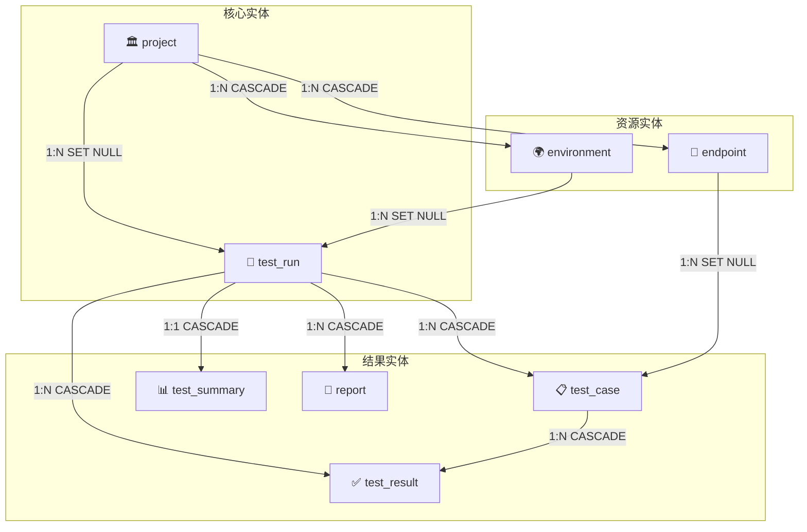

<![CDATA[# ⛧ 数据库实体关系图 — LLMTestAgent ⛧

---

> *「数据之间的纽带，如同命运的丝线——不可见，却牵动万物。」*

---

## 一、实体关系总览

```mermaid
erDiagram
    PROJECT ||--o{ ENVIRONMENT : "拥有环境"
    PROJECT ||--o{ ENDPOINT : "包含接口"
    PROJECT ||--o{ TEST_RUN : "发起测试"
    ENVIRONMENT ||--o{ TEST_RUN : "关联环境"
    TEST_RUN ||--o{ TEST_CASE : "包含用例"
    TEST_RUN ||--o{ TEST_RESULT : "产出结果"
    TEST_RUN ||--|| TEST_SUMMARY : "汇总统计"
    TEST_RUN ||--o{ REPORT : "生成报告"
    ENDPOINT ||--o{ TEST_CASE : "对应用例"
    TEST_CASE ||--o{ TEST_RESULT : "执行结果"

    PROJECT {
        int id PK
        text name UK
        text base_url
        text description
        int status
        text created_at
        text updated_at
    }

    ENVIRONMENT {
        int id PK
        int project_id FK
        text name
        text base_url
        text description
        text variables
        int is_default
        int status
        text created_at
        text updated_at
    }

    ENDPOINT {
        int id PK
        int project_id FK
        text operation_id
        text name
        text path
        text method
        text tags
        text summary
        text description
        text params
        text headers
        text body
        text responses
        text security
        text content_type
        int deprecated
        int status
        int version
        text created_at
        text updated_at
    }

    TEST_RUN {
        int id PK
        int project_id FK
        int environment_id FK
        text name
        text status
        text trigger_type
        text input_file
        text input_snapshot
        text config_snapshot
        text llm_provider
        text llm_model
        int total_cases
        int passed_cases
        int failed_cases
        int skipped_cases
        int error_cases
        float pass_rate
        text started_at
        text finished_at
        float total_duration
        text error_message
        text created_at
        text updated_at
    }

    TEST_CASE {
        int id PK
        int run_id FK
        int endpoint_id FK
        text case_id
        text case_name
        text url
        text method
        text scenario_type
        text priority
        text headers
        text body
        text params
        text cache_rules
        text assert_rules
        text expected_result
        text description
        text remark
        text unique_hash
        text generated_by
        int status
        text created_at
        text updated_at
    }

    TEST_RESULT {
        int id PK
        int run_id FK
        int test_case_id FK
        text case_id
        text case_name
        text status
        text request_url
        text request_method
        text request_headers
        text request_body
        text query_params
        int response_status_code
        text response_headers
        text response_body
        float response_time
        text error_message
        int retry_count
        text started_at
        text finished_at
        text created_at
    }

    TEST_SUMMARY {
        int id PK
        int run_id FK
        int total
        int passed
        int failed
        int skipped
        int error
        float pass_rate
        float avg_response_time
        float min_response_time
        float max_response_time
        float p95_response_time
        float total_duration
        text failure_reasons
        text started_at
        text finished_at
        text created_at
    }

    REPORT {
        int id PK
        int run_id FK
        text format
        text file_path
        int file_size
        text generated_at
    }
```

---

## 二、关系详解

> *「万物相连，因果相循。一表之变，牵动全局。」*

| 主表 | 关系 | 从表 | 外键 | 删除策略 |
|------|:----:|------|------|----------|
| `project` | 1 : N | `environment` | `environment.project_id` | CASCADE |
| `project` | 1 : N | `endpoint` | `endpoint.project_id` | CASCADE |
| `project` | 1 : N | `test_run` | `test_run.project_id` | SET NULL |
| `environment` | 1 : N | `test_run` | `test_run.environment_id` | SET NULL |
| `test_run` | 1 : N | `test_case` | `test_case.run_id` | CASCADE |
| `test_run` | 1 : N | `test_result` | `test_result.run_id` | CASCADE |
| `test_run` | 1 : 1 | `test_summary` | `test_summary.run_id` (UNIQUE) | CASCADE |
| `test_run` | 1 : N | `report` | `report.run_id` | CASCADE |
| `endpoint` | 1 : N | `test_case` | `test_case.endpoint_id` | SET NULL |
| `test_case` | 1 : N | `test_result` | `test_result.test_case_id` | CASCADE |

---

## 三、关系拓扑图

---

## 四、设计要点

> *「约束即秩序，索引即速度，级联即纪律。」*

### 删除策略

- **CASCADE** — 父记录删除时，子记录一同清除。用于强依赖关系（如 TestRun 删除时清除其所有用例和结果）。
- **SET NULL** — 父记录删除时，子记录外键置空。用于弱引用关系（如项目删除后 TestRun 保留但断开关联）。

### 唯一约束

- `project.name` — 项目名全局唯一
- `(endpoint.project_id, endpoint.path, endpoint.method)` — 同一项目下接口路径+方法唯一
- `test_summary.run_id` — 每次测试运行仅有一条汇总记录

---

*📎 相关文档：[系统流程图](SystemFlowchart.md) · [数据库设计](DatabaseDesign.md)*
]]>