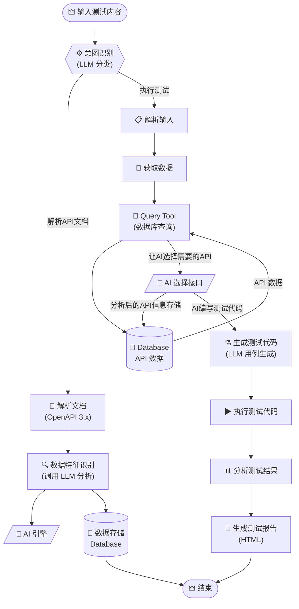
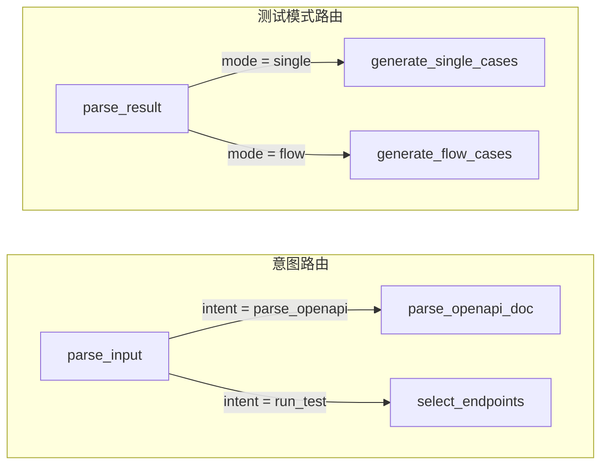
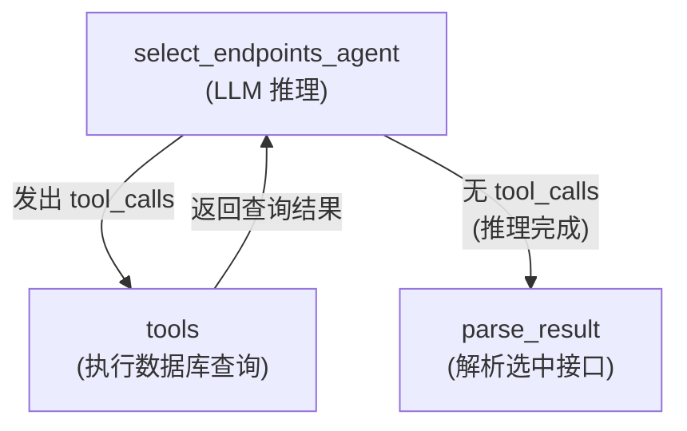
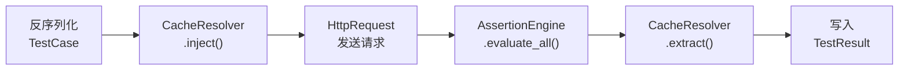

<![CDATA[# ⛧ 系统流程图 — LLMTestAgent ⛧

---

> *「以大模型之智，驭测试之道。自然语言为钥，开启自动化测试的黑暗华章。」*

---

## 一、总览

本文描述 **LLMTestAgent** 系统的完整工作流程——从用户输入自然语言指令开始，经由意图识别分流至「文档解析」或「测试执行」两条主线，最终汇聚于结果输出。

---

## 二、系统主流程

---

## 三、节点详解

> *「每一节点，皆为齿轮；每一流转，皆为命运。」*

| 序号 | 节点 | 职责描述 |
|:----:|------|----------|
| 1 | **输入测试内容** | 用户通过 CLI 或 Web API 输入自然语言指令，可附带 OpenAPI 文档路径 |
| 2 | **意图识别** | LLM 解析指令，分类为 `run_test`（执行测试）或 `parse_openapi`（解析文档） |
| 3 | **解析文档** | 读取 OpenAPI 3.x 文件（JSON/YAML），提取项目、接口元数据 |
| 4 | **数据特征识别** | 调用 LLM 对接口进行语义理解与结构化分析 |
| 5 | **数据存储** | 将解析结果持久化至 SQLite 数据库 |
| 6 | **解析输入** | 提取用户指令中的测试模式（single/flow）与目标范围 |
| 7 | **获取数据** | 从数据库中查询已存储的项目与接口信息 |
| 8 | **Query Tool** | LangGraph Agent Tool — 执行数据库模糊搜索与接口列表获取 |
| 9 | **AI 选择接口** | LLM Agent 根据用户意图自主挑选目标接口集合 |
| 10 | **生成测试代码** | LLM 基于接口元数据生成覆盖多场景的测试用例 |
| 11 | **执行测试代码** | HTTP 客户端发送请求，断言引擎校验响应 |
| 12 | **分析测试结果** | 统计通过率、响应时间、失败原因等指标 |
| 13 | **生成测试报告** | 输出双层折叠式 HTML 可视化报告 |

---

## 四、分支路由详情

---

## 五、Agent Tool-Calling 循环

> *「智能体与工具之间的对话，如同巫师与魔典的低语。」*

---

## 六、执行引擎管线

---

> *「流程之末，报告铸成，真相大白于天下。」*

---

*📎 相关文档：[ER 图](ER.md) · [数据库设计](DatabaseDesign.md)*
]]>