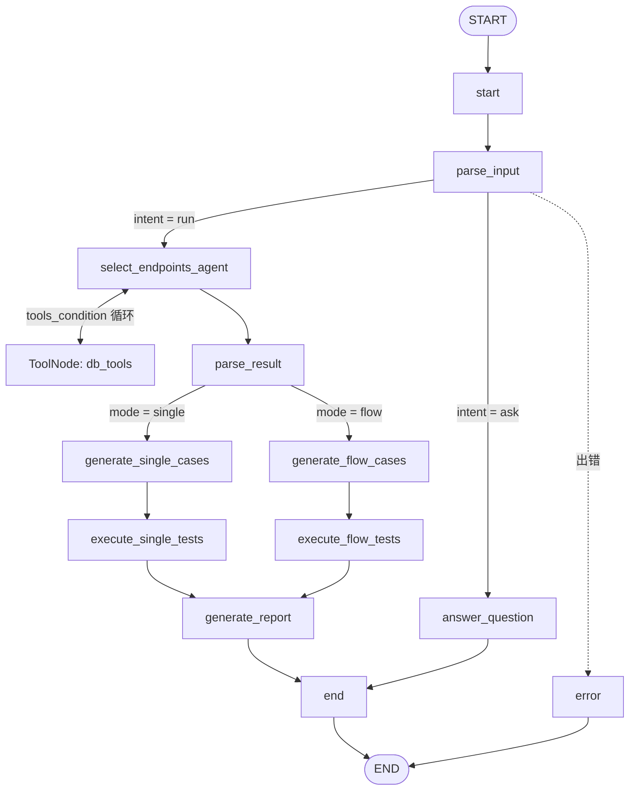
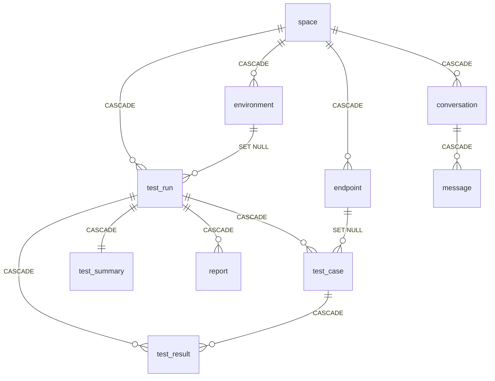
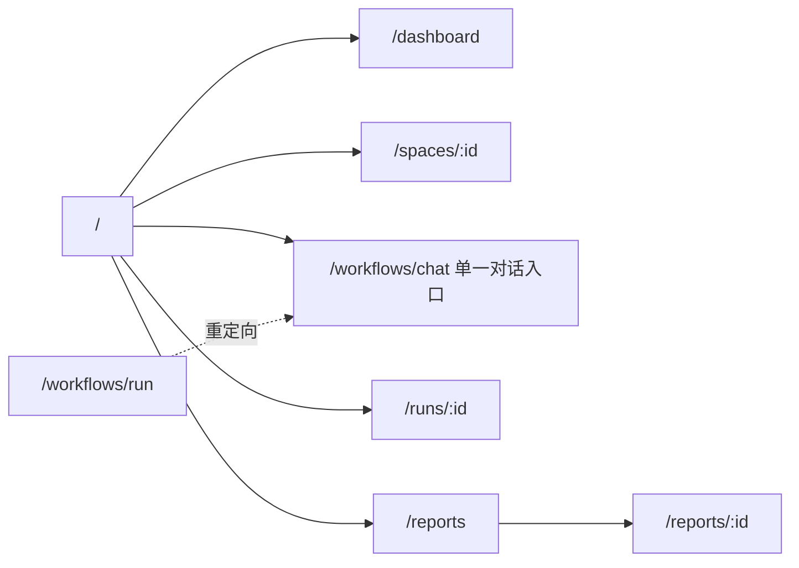

# TestAgents 架构设计文档

> 版本：v0.5（对应当前代码实现，2026-08）
> 定位：本文是对 **当前真实实现** 的整体架构说明，跨越前端、后端、数据层、工作流引擎与外部依赖。
>
与其他文档关系：本文为总览；[数据库设计](DatabaseDesign.md)、[ER 图](ER.md)、[系统流程图](SystemFlowchart.md)、[页面设计准则](UI-Design-Guidelines.md)。

---

## 一、系统总览

**TestAgents** 是一个由大模型驱动的 API 自动化测试平台：用户用自然语言描述测试意图，系统解析 OpenAPI 文档入库、由 Agent
挑选接口、生成多场景用例、执行 HTTP 请求并断言、最终产出报告；同时提供一个安全审计前置的多轮对话入口用于 API 测试问答。

### 1.1 技术栈

| 层   | 技术                                                                                                 |
|-----|----------------------------------------------------------------------------------------------------|
| 前端  | React 19 + TypeScript + Vite + React Router + TanStack Query + Tailwind CSS v4 + shadcn/ui + Radix |
| 后端  | Python + FastAPI + SQLAlchemy 2.0 + LangChain / LangGraph + structlog                              |
| 数据  | SQLite 3（WAL 模式，雪花 ID 主键）                                                                          |
| 向量库 | ChromaDB（连接层就绪，未接入业务）                                                                              |
| LLM | LiteLLM Router 多模型路由（glm / deepseek 等）+ langchain-litellm（ChatLiteLLMRouter）                              |

### 1.2 顶层架构图

```mermaid
flowchart TB
  subgraph FE [前端 React SPA]
    layout[AppLayout + Sidebar]
    pages[Pages: dashboard / space-detail / security-chat / reports / run-detail]
    hooks[TanStack Query Hooks]
    layout --> pages --> hooks
  end

  subgraph BE [后端 FastAPI]
    api[api/v1 路由层]
    services[data/services 业务层]
    repos[data/repositories DAO 层]
    graph[LangGraph 测试工作流]
    llm[LiteLLM Router 多模型]
    api --> services --> repos
    api --> graph
    graph --> llm
    api --> llm
  end

  subgraph STORE [存储与外部]
    sqlite[(SQLite: 权威数据)]
    chroma[(ChromaDB: 语义检索, 未接入)]
    target[被测 API 服务]
  end

  hooks -->|"HTTP /api/v1 (Vite proxy)"| api
  hooks -->|"fetch 流式 /chat/stream"| api
  repos --> sqlite
  graph -->|HTTP 执行用例| target
  llm -.规划.- chroma
```

### 1.3 请求入口与部署形态

- 前端开发服务器（Vite，端口 3000）通过 `proxy` 把 `/api` 转发到后端 `http://localhost:8000`。
- 后端 `backend/app.py` 是唯一入口，`uvicorn app:app --host 0.0.0.0 --port 8000`，全部业务路由挂在 `/api/v1` 前缀下，另有
  `GET /health`、`/docs`、`/redoc`。

---

## 二、后端架构

### 2.1 分层结构（`backend/src/`）

| 层      | 目录                      | 职责                                                |
|--------|-------------------------|---------------------------------------------------|
| API 层  | `api/v1/*`              | FastAPI 路由；`api/deps.py` 提供请求级 `get_db()` Session |
| 业务层    | `data/services/*`       | 业务编排（如 `ApiDocStorage`、`ConversationService`）     |
| 数据访问层  | `data/repositories/*`   | 继承泛型 `BaseRepository[T]` 的 CRUD                   |
| 模型层    | `data/models/*`         | SQLAlchemy ORM（`DeclarativeBase`）                 |
| Schema | `data/schemas/*`        | Pydantic 请求/响应模型                                  |
| 工作流    | `graph/*`、`workflow.py` | LangGraph 有状态测试工作流                                |
| Prompt | `prompts/*`             | Jinja2 YAML 模板 + Builder/Formatter 体系             |
| 基础设施   | `core/*`                | 配置、数据库、LLM、Chroma、缓存、日志                           |
| 工具     | `utils/*`               | 雪花 ID、HTTP 封装、OpenAPI 解析                          |

### 2.2 应用启动（`app.py`）

- `FastAPI(lifespan=lifespan, default_response_class=SafeJSONResponse)`。
- **`SafeJSONResponse` / `SafeIntEncoder`**：把超过 JS 安全整数（`2^53-1`）的雪花 ID 序列化为字符串，防止前端精度丢失。这是贯穿全栈的关键设计（前端
  `types.ts` 中 ID 均为 `string | number`）。
- **lifespan 启动序列**：`init_config()` → `init_database_from_config()` → `init_database_from_orm()`（建表 + 创建分析视图）；关闭时
  `db_manager.close()`。
- **CORS**：来源取环境变量 `CORS_ORIGINS`（默认 `http://localhost:5173`）。

### 2.3 核心基础设施（`src/core/`）

| 模块                       | 关键类/函数                                       | 说明                                                                                                                         |
|--------------------------|----------------------------------------------|----------------------------------------------------------------------------------------------------------------------------|
| `config.py`              | `AppConfig` + `get_config()`/`init_config()` | Pydantic 配置模型；仅从 YAML 加载（已移除 `${ENV}` / `.env`）；配置段：llm/execution/output/database/chroma/logging/langsmith/case_generation |
| `database/connection.py` | `DatabaseManager`（线程安全单例）                    | SQLite 自动启用 `WAL` + 外键 + UTF-8；`get_session()` 上下文自动 commit/rollback；`ensure_db()` 幂等初始化（graph 节点/tools 场景） |
| `llm/llm_client.py`      | `create_chat_model()` + `LLMClient`          | 基于 `litellm.Router(model_list)` + `ChatLiteLLMRouter` 的统一封装（同步/异步/流式/工具绑定/事件流），兼容层接口不变 |
| `llm/llm_service.py`     | `LLMService` + `get_llm_service()`           | 新 LLM 客户端：直接收发 LangChain `BaseMessage`，返回原始 `AIMessage`/`AIMessageChunk`（含 `usage_metadata`/`tool_calls`） |
| `chroma/connection.py`   | `ChromaManager`（单例）                          | HttpClient + Token 认证、集合/文档 CRUD、LangChain VectorStore；**未接入业务**                                                           |
| `cache/data_cache.py`    | `DataCache`                                  | 线程安全缓存，`create_scoped(run_id)` 隔离并发工作流的步骤间变量                                                                               |
| `logging.py`             | `StructLogger`                               | structlog 彩色/JSON 双输出 + 文件轮转 + `log_execution_time` 装饰器                                                                    |

### 2.4 API 路由清单（`src/api/v1/`）

| 路由文件              | prefix           | 端点                                                                                                    |
|-------------------|------------------|-------------------------------------------------------------------------------------------------------|
| `space.py`        | `/spaces`        | POST `/` · GET `/` · GET `/{id}` · PUT `/{id}` · DELETE `/{id}`（级联）· POST `/parse/openapi/{space_id}` |
| `endpoint.py`     | `/endpoints`     | POST `/` · POST `/batch` · GET `/` · GET `/{id}` · PUT `/{id}` · DELETE `/{id}`                       |
| `environment.py`  | `/environments`  | POST `/` · GET `/` · GET `/{id}` · PUT `/{id}` · DELETE `/{id}`                                       |
| `workflow.py`     | `/workflows`     | POST `/upload/openapi` · POST `/run/stream`                                                           |
| `test_run.py`     | `/test/runs`     | GET `/` · GET `/{run_id}`（含 cases + results）                                                          |
| `report.py`       | `/reports`       | GET `/` · GET `/{id}` · GET `/{id}/download`                                                          |
| `chat.py`         | `/chat`          | POST `/stream`（流式，安全审计前置，多轮上下文，消息落库）                                                                  |
| `conversation.py` | `/conversations` | POST `/` · GET `/` · GET `/{id}` · GET `/{id}/messages` · PUT `/{id}` · DELETE `/{id}`                |

> `workflow.py` 负责 OpenAPI 文档的上传与流式执行（`/run/stream`）；`space.py` 的 `POST /parse/openapi/{space_id}`
> 提供直接解析入库。触发测试已统一由 `chat.py` 的 `POST /chat/stream` 承担（自然语言 + 流式）。

---

## 三、LangGraph 测试工作流

### 3.1 图结构

编排入口 `src/workflow.py` 的 `build_graph()` 与 `TestWorkflow` 类。



### 3.2 节点职责（`src/graph/nodes/`）

| 节点                           | 职责                                                            |
|------------------------------|---------------------------------------------------------------|
| `start_node`                 | 校验 `raw_input`，初始化 `next_node` / `run_status`                |
| `parse_input_node`           | LLM 意图识别：`run`（执行测试）/ `ask`（问答），及测试模式 `single` / `flow` |
| `select_endpoints_node`      | Agent 绑定 DB 工具挑选接口（ToolNode 循环），并解析 `selected_endpoints`   |
| `generate_single_cases_node` | 逐接口调 LLM 生成用例，建 `TestRun`、写 `TestCase`                        |
| `generate_flow_cases_node`   | 一次性传所有接口，LLM 编排带 `step_order` 的流程用例                           |
| `execute_single_tests_node`  | 按优先级 P0>P1>P2 执行，汇总统计                                         |
| `execute_flow_tests_node`    | 按 `step_order` 顺序执行，前置失败则依赖步骤置 `skipped`                      |
| `generate_report_node`       | 生成 HTML 报告并写 `Report` 记录                                      |
| `answer_question_node`       | ask 意图问答：安全/意图审计 + 历史上下文 + LLM 回答（走图或 `/chat/stream` 直接调用） |
| `security_audit_node`        | 安全 + API 测试意图审计（供 `/chat/stream` 使用）                          |
| `task_complexity_node`       | 复杂度分级选模型（已实现，**未接入主图**）                                       |
| `end_node` / `error_node`    | 终态 / 错误终态                                                     |

**路由**（`src/graph/route.py`）：`route_by_next_node`（通用 next_node 分流）、`route_by_intent`（RUN → SELECT_ENDPOINTS_AGENT / ASK → ANSWER_QUESTION）、`route_by_test_mode`。

**状态**（`src/graph/state.py`）：`AgentState` 继承 `MessagesState`（自带 `messages`），字段含 `next_node`、`raw_input`、
`user_intent`、`test_mode`、`space_id`、`selected_endpoints`、`run_id`、`test_results_summary`、`report_path`、
`answer_content`、`conversation_id`、`error_message` 等。

### 3.3 执行引擎（`src/graph/executor/`）

| 组件                | 职责                                                                                                                        |
|-------------------|---------------------------------------------------------------------------------------------------------------------------|
| `TestExecutor`    | 反序列化用例 → CacheResolver 注入 → `HttpRequest` 发请求（含重试）→ AssertionEngine 断言 → CacheResolver 提取 → 写 `TestResult`（响应体 >50KB 截断）  |
| `CacheResolver`   | `inject()`/`extract()`/依赖检查；`cache_rules` 约定注入目标（headers/body/params + 模板）与提取路径（简易 JSONPath）                              |
| `AssertionEngine` | `evaluate_all()`，支持 `== != > < >= <= contains not_contains exists not_exists matches`、`status_code`、`response_time` 等 DSL |

**工具**（`src/graph/tools/`）：`db_tools`（`search_space`、`get_space_endpoints`，接入主图）；`fs_tools`（文件/命令工具，未接入主图）。

---

## 四、数据层与数据模型

### 4.1 分层与约定

- 分层：`models`(ORM) → `schemas`(Pydantic) → `repositories`(继承 `BaseRepository[T]`) → `services`(业务)。
- 主键：全局雪花 ID（`utils/id/snow_id_utils.py` 的 `next_id`，`autoincrement=False`）。
- 时间：`Text` 存本地时间字符串（`local_now`）。
- 迁移：`init_database_from_orm()` 默认按 ORM 建表并创建 3 个分析视图（`v_run_overview`、`v_api_pass_rate`、
  `v_scenario_distribution`）；`EXPECTED_TABLES` 现含 10 张表（含 conversation / message）。

### 4.2 实体关系（含新增会话表）



**测试域实体**（详见 [DatabaseDesign.md](DatabaseDesign.md)）：`space`、`environment`、`endpoint`、`test_run`、`test_case`、
`test_result`、`test_summary`、`report`。

**对话域实体**：

| 表              | 关键字段                                                                                                                    | 说明                               |
|----------------|-------------------------------------------------------------------------------------------------------------------------|----------------------------------|
| `conversation` | `id`、`space_id`(FK, 可空, CASCADE)、`title`、`mode`(Ask/Plan/Run)、`status`(1/0)、`last_message_at`、`created_at`、`updated_at` | 会话头，供侧边栏列表；`space_id` 可空以支持无空间会话 |
| `message`      | `id`、`conversation_id`(FK, CASCADE)、`role`(user/assistant/system)、`content`、`meta`(JSON)、`created_at`                   | append-only 消息，按时间升序加载           |

---

## 五、对话历史子系统

### 5.1 设计取向

对齐 Cursor（composer/bubble）、Codex（thread/rollout）等产品的共性：**会话头与消息两级分离**，会话头存元数据供列表，消息
append-only。会话数据以 SQLite 为权威存储（非 Chroma、非 localStorage、不复用 `test_run`。

### 5.2 流式对话时序

`POST /chat/stream` 按 `mode` 分流：`run` → 走完整 graph（意图判断后执行测试或回答），SSE 事件流输出，结束后测试摘要落库
assistant 消息；`ask` → 走 `answer_question_node`（安全审计 + 回答），text/plain 分块输出；`plan` → 占位提示。

```mermaid
sequenceDiagram
  participant FE as SecurityChatPage
  participant API as POST /chat/stream
  participant SVC as ConversationService
  participant AUD as security_audit_node
  participant LLM as LiteLLM Router

  FE->>API: instruction + conversation_id? + mode + space_id?
  API->>SVC: 无 id 则建会话; 落库 user 消息
  API-->>FE: 响应头 X-Conversation-Id
  alt mode = run
    API->>LLM: graph 全流程（意图判断 → 测试/回答），SSE 事件流
    LLM-->>FE: data: {start/node/final/error} 结构化事件
    API->>SVC: 结束后落库 assistant 摘要
  else mode = ask
    API->>AUD: 线程池执行安全/意图审计
    alt 命中风险 / 非测试内容
      API-->>FE: 返回固定拦截文案
    else 通过
      API->>SVC: 加载历史消息拼多轮上下文
      API->>LLM: system + 历史 + 当前
      LLM-->>FE: 逐 token 流式返回（text/plain）
    end
    API->>SVC: 结束时落库 assistant 全文
  else mode = plan
    API-->>FE: 占位提示（功能待定）
  end
```

### 5.3 前端接入

- `hooks/use-conversations.ts`：`useConversations`、`useConversationMessages`、`useCreateConversation`、
  `useUpdateConversation`、`useDeleteConversation`。
- `lib/stream.ts` 的 `streamChat`：支持 `conversation_id`/`mode`，从响应头读 `X-Conversation-Id` 回调。
- `components/layout/spaces-section.tsx`：侧边栏「空间」按空间分组展示真实会话，支持新建/历史跳转/重命名/删除。
- `pages/run/security-chat.tsx`：多轮消息气泡列表，按 URL `conversation_id` 加载历史，首轮写回 URL 并刷新会话列表。

---

## 六、前端架构

### 6.1 目录分层（`frontend/src/`）

| 目录                     | 职责                                                                                                                    |
|------------------------|-----------------------------------------------------------------------------------------------------------------------|
| `components/layout/`   | 应用骨架：`app-layout`、`sidebar`、`spaces-section`                                                                          |
| `components/ui/`       | shadcn/ui 基元（button、dialog、dropdown-menu、tabs 等）                                                                      |
| `components/shared/`   | 复用业务组件：`data-table`、`status-badge`、`http-method-badge`、`confirm-delete-dialog`、`empty-state` 等                        |
| `components/markdown/` | Markdown 渲染（remark/rehype、Shiki 高亮、Mermaid、流式光标）                                                                      |
| `pages/`               | 路由页面：dashboard、project-detail、run（security-chat/run-detail）、report、error                                              |
| `hooks/`               | TanStack Query 数据 hooks（projects/endpoints/environments/test-runs/reports/conversations/workflows）+ 流式 markdown hooks |
| `lib/`                 | `api.ts`(axios 实例)、`stream.ts`(fetch 流式)、`types.ts`(全局类型)、工具函数                                                        |
| `router.tsx`           | React Router 路由表（懒加载）                                                                                                 |

### 6.2 应用骨架与路由

- 布局：左侧 `Sidebar`（250px，可折叠）+ 右侧 `<Outlet />` 主内容区，无顶部
  Header（见 [UI-Design-Guidelines.md](UI-Design-Guidelines.md)）。
- 侧边栏导航：仪表盘 / 新建对话（`/workflows/chat`）/ 报告；下方「空间」区按空间分组展示会话列表。
- 路由要点：`/` 重定向 `/dashboard`；`/workflows/run` 重定向 `/workflows/chat`（历史入口兼容）；`spaces/:id/*` 子路径重定向到空间详情。



### 6.3 数据获取与状态

- 统一用 **TanStack Query** 管理服务端状态：`queryKey` 约定（如 `["conversations", params]`、
  `["conversation-messages", id]`），变更后 `invalidateQueries` 刷新。
- 普通请求走 `lib/api.ts`（axios，`baseURL: /api/v1`）；**流式对话** 因 axios 不适合流式，单独用 `lib/stream.ts` 的原生
  `fetch + ReadableStream`。
- 通知统一用 `sonner` toast。

### 6.4 单一对话入口

历史上存在「新建测试」(`workflow-run.tsx` → `useRunTest` → `POST /workflows/run/test`) 与「安全对话」两个入口。现已合并为单一入口
`/workflows/chat`：删除了 `workflow-run.tsx` 与 `useRunTest`，侧边栏/仪表盘入口与 `/workflows/run` 均指向对话页。后端
`POST /workflows/run/test` 及配套的 `GET /status/{run_id}`（含 `BackgroundTasks`、`_running_tasks` 跟踪逻辑）已一并删除，触发测试统一走
`POST /chat/stream`。

---

## 七、LLM 与 Prompt 体系

### 7.1 LiteLLM Router 统一模型层

`config.yaml` 顶层 `model_list` 定义全部模型（`model_name` + `litellm_params`），由 `litellm.Router` 统一路由
（fallback / load balancing / 复杂度分流）：

| model_name          | 底层模型                    | 用途                         |
|--------------------|---------------------------|----------------------------|
| `glm-4-flash`      | `zai/glm-4-flash`         | 简单任务                      |
| `glm-4.7-flash`    | `zai/glm-4.7-flash`       | 中等任务                      |
| `deepseek-v4-flash` | `deepseek/deepseek-v4-flash` | 复杂任务（高并发）              |
| `deepseek-v4-pro`  | `deepseek/deepseek-v4-pro` | 推理任务                      |
| `smart-router`     | `auto_router/complexity_router` | **默认**：按提示词复杂度自动分流到上述 4 级 |

**两条接入路径**：

| 客户端                         | 消息格式                     | 返回                               | 适用场景                |
|------------------------------|--------------------------|----------------------------------|---------------------|
| `llm_client.LLMClient`（兼容层） | `list[dict]` OpenAI 格式   | `str` / `AIMessage`（历史接口，兼容旧调用方） | 既有 graph 节点调用       |
| `llm_service.LLMService`（新）   | `list[BaseMessage]`      | `AIMessage` / `AIMessageChunk`（原生）  | 新代码推荐              |

- `LLMClient`：`create_chat_model()` 返回 `ChatLiteLLMRouter`（`litellm.Router` + `ChatLiteLLMRouter` 包装），提供 `chat`、
  `invoke_with_tools`、同步/异步流式、原始消息块流、工具绑定流、事件流；全局单例 `get_llm_client()`。
- `LLMService`：直接收发 LangChain `BaseMessage`（`HumanMessage`/`SystemMessage`/`AIMessage`），仅 `chat`/`achat` 返回
  `str`，其余方法返回原始消息对象（含 `usage_metadata` / `tool_calls` / `tool_call_chunks`）；全局单例 `get_llm_service()`。
- **Token 用量**：非流式 `AIMessage.usage_metadata`；流式需 `stream_options={"include_usage": True}`；费用可借 `litellm.completion_cost()`。

### 7.2 Prompt 体系（`src/prompts/`）

- **loader**：`PromptLoader` 读 `templates/*.yaml`，用 Jinja2 渲染。
- **builders**：基类 `BasePromptBuilder`，子类 `IntentPromptBuilder`、`SelectEndpointsBuilder`、`CasePromptBuilder`、
  `FlowCasePromptBuilder`、`TaskComplexityBuilder`、`SystemSafetyBuilder`。
- **formatters**：`case_formatter` 组装场景类型与 API 信息文本。
- **templates**：intent / select_endpoints / single_case / flow_case / task_complexity / system_safety 等 YAML。

---

## 八、配置体系

- 配置文件：`backend/config/config.yaml`，`load_config()` 仅从 YAML 读取配置（已移除 `.env` / `${ENV}` 变量替换）。
- 配置段（`AppConfig`）：`llm`（`default_model` 默认模型名）、顶层 `model_list`（LiteLLM Router 模型路由列表）、
  `execution`（超时/重试/并发/依赖失败策略）、`output`（时间戳目录）、`database`、`chroma`、`logging`、`langsmith`（可观测性）、
  `case_generation`（场景列表）。

> 安全提示：`model_list` 中各模型的 `api_key` 以明文写入本地 `config.yaml`，务必确保 `config.yaml` 已在 `.gitignore` 中，
> 避免明文入库；如需更安全的密钥注入方案（如运行时 secret 覆盖层），属于安全审查的高优先级项。

---

## 九、跨切面与关键设计

| 主题     | 设计                                                                      |
|--------|-------------------------------------------------------------------------|
| 大整数精度  | 后端 `SafeJSONResponse` 把雪花 ID 序列化为字符串；前端类型 ID 为 `string \| number`       |
| 并发执行隔离 | `DataCache.create_scoped(run_id)` 按运行隔离步骤间变量                            |
| 流式执行   | 测试经 `POST /chat/stream` 触发并以流式增量返回结果；前端用 `fetch + ReadableStream` 消费    |
| 阻塞规避   | `/chat/stream` 把阻塞的安全审计放入线程池，避免阻塞事件循环                                   |
| 级联删除   | 空间删除级联 environment/endpoint/test_run/conversation；test_run 相关子表 CASCADE |
| 数据一致性  | SQLite 为 Source of Truth；Chroma（规划）仅作语义索引层                              |

---

## 十、演进方向（规划中，未实现）

1. **Chroma 语义检索层**：接入 lifespan 初始化，`KnowledgeIndexer`/`KnowledgeRetriever`，Ask/选接口的 RAG 增强，Embedding
   配置。
2. **Plan 执行闭环**：`mode=Plan` 生成结构化测试计划 → 用户确认 → 注入 `AgentState` 复用执行链路 → 回写 `conversation` 与
   `test_run` 关联。
3. **fs_tools 接入主图**：目前已实现但未挂入工作流。
4. **会话与 run 关联**：`conversation` 增加 `test_run_id` 关联字段，打通对话与执行产物。
5. **测试空间功能**：在测试空间详情页面解析 OpenAPI文档时可以选择要导入的 endpoint 和 env。
6. **Token使用记录**：根据LiteLLM的功能，新增相关表记录token，模型等信息

> 已完成（2026-08）：**LLM 网关**（LiteLLM 统一模型入口 + 按任务复杂度分流，`smart-router` 默认路由）见 §7.1；
> **space_id 全链路**（`AgentState.space_id` + run 流程注入）见 §3.2。

---

## 十一、相关文档索引

| 文档                                                 | 内容            |
|----------------------------------------------------|---------------|
| [DatabaseDesign.md](DatabaseDesign.md)             | 各表字段、约束、索引、枚举 |
| [ER.md](ER.md)                                     | 实体关系图与拓扑      |
| [SystemFlowchart.md](SystemFlowchart.md)           | 测试工作流流程图与节点详解 |
| [UI-Design-Guidelines.md](UI-Design-Guidelines.md) | 前端页面设计准则      |
| [CHANGELOG.md](../CHANGELOG.md)                    | 设计变更日志        |

关键源码入口：`backend/app.py`、`backend/src/workflow.py`、`backend/src/graph/`、`backend/src/api/v1/`、
`frontend/src/router.tsx`、`frontend/src/components/layout/sidebar.tsx`。

---

## 十二、修订记录

| 版本  | 日期         | 说明                                                                                                                       |
|-----|------------|--------------------------------------------------------------------------------------------------------------------------|
| 0.5 | 2026-08-28 | LLM 层重构：多 Provider 工厂 → LiteLLM Router（`model_list` + `smart-router` 复杂度分流）+ `ChatLiteLLMRouter`；新增 `LLMService`（原生 BaseMessage）；graph 意图改 `run`/`ask`（`parse_openapi` 下线，`answer_question` 接入主图）；`AgentState` 增 `space_id`/`answer_content`；`/chat/stream` 按 mode 分流；`db_bootstrap` 合并入 `connection.ensure_db` |
| 0.4 | 2026-08-27 | `project` → `space` 全文术语同步；路由清单更新 `/spaces`；tool 名同步 `search_space`/`get_space_endpoints`；`test_run.space_id` 改为 CASCADE |
| 0.3 | 2026-08-13 | 初稿：整合前后端全景架构；校准对话历史已实现、单一对话入口、Ask/Plan 现状；标注 Chroma/Plan 为演进方向                                                           |
