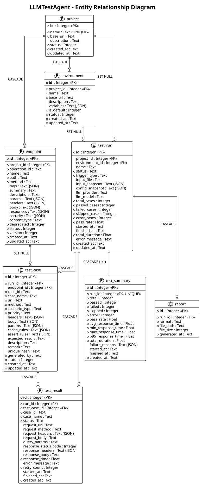
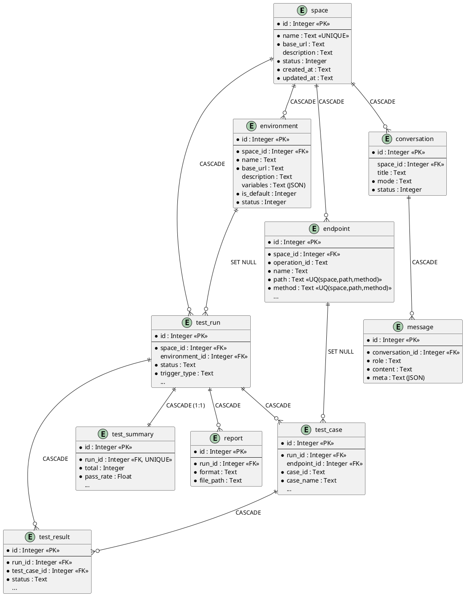
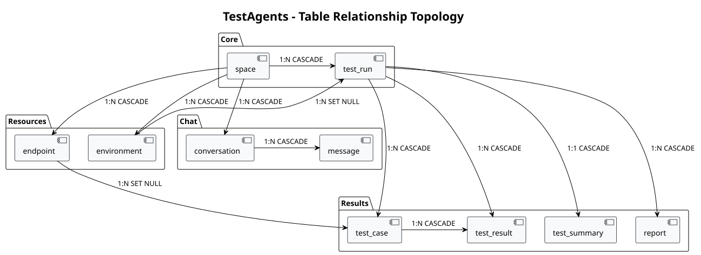
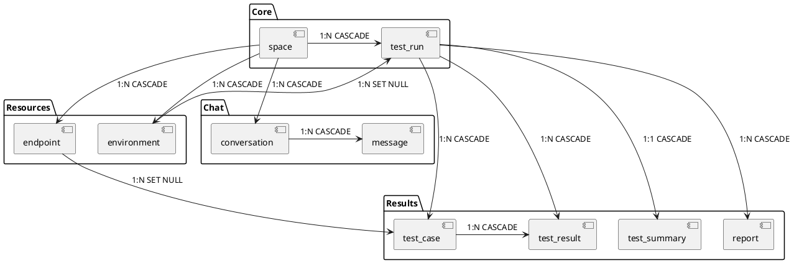

# 数据库实体关系图

---

## 一、实体关系总览

PlantUML 源码（点击展开）

---

## 二、关系详解

| 主表             |  关系   | 从表             | 外键                             | 删除策略     |
|----------------|:-----:|----------------|--------------------------------|----------|
| `space`        | 1 : N | `environment`  | `environment.space_id`         | CASCADE  |
| `space`        | 1 : N | `endpoint`     | `endpoint.space_id`            | CASCADE  |
| `space`        | 1 : N | `test_run`     | `test_run.space_id`            | CASCADE  |
| `space`        | 1 : N | `conversation` | `conversation.space_id`（可空）    | CASCADE  |
| `environment`  | 1 : N | `test_run`     | `test_run.environment_id`      | SET NULL |
| `test_run`     | 1 : N | `test_case`    | `test_case.run_id`             | CASCADE  |
| `test_run`     | 1 : N | `test_result`  | `test_result.run_id`           | CASCADE  |
| `test_run`     | 1 : 1 | `test_summary` | `test_summary.run_id` (UNIQUE) | CASCADE  |
| `test_run`     | 1 : N | `report`       | `report.run_id`                | CASCADE  |
| `endpoint`     | 1 : N | `test_case`    | `test_case.endpoint_id`        | SET NULL |
| `test_case`    | 1 : N | `test_result`  | `test_result.test_case_id`     | CASCADE  |
| `conversation` | 1 : N | `message`      | `message.conversation_id`      | CASCADE  |

---

## 三、关系拓扑图

PlantUML 源码（点击展开）

---

## 四、实体清单

| 表名             | 模型文件                              | 职责                         |
|----------------|-----------------------------------|----------------------------|
| `space`        | `src/data/models/space.py`        | 工作空间，管理多个被测服务，多空间隔离        |
| `environment`  | `src/data/models/environment.py`  | 测试环境，支持多环境对比               |
| `endpoint`     | `src/data/models/endpoint.py`     | OpenAPI 解析后的 API 定义        |
| `test_run`     | `src/data/models/test_run.py`     | 执行批次，关联配置快照与执行环境           |
| `test_case`    | `src/data/models/test_case.py`    | 测试用例（LLM 生成 / 手工 / 导入）     |
| `test_result`  | `src/data/models/test_result.py`  | 用例执行结果（请求/响应全量记录）          |
| `test_summary` | `src/data/models/test_summary.py` | 批次聚合摘要（1:1）                |
| `report`       | `src/data/models/report.py`       | 报告文件记录                     |
| `conversation` | `src/data/models/conversation.py` | 会话元数据（Ask / Plan / Run 模式） |
| `message`      | `src/data/models/message.py`      | 会话消息（append-only）          |

---

## 五、设计要点

### 删除策略

- **CASCADE** — 父记录删除时，子记录一同清除。用于强依赖关系（如 TestRun 删除时清除其所有用例和结果）。
- **SET NULL** — 父记录删除时，子记录外键置空。用于弱引用关系（如环境删除后 TestRun 保留但断开关联）。
- ⚠️ 注意：`space → test_run` 为 **CASCADE**（旧版为 SET NULL）——空间删除会连带删除其全部执行记录，如需保留历史请先导出报告。

### 唯一约束

- `space.name` — 空间名全局唯一
- `(endpoint.space_id, endpoint.path, endpoint.method)` — 同一空间下接口路径+方法唯一
- `test_summary.run_id` — 每次测试运行仅有一条汇总记录

### ID 生成

- 所有表主键由应用层雪花算法生成（`src/utils/id.py::next_id`），非数据库自增。

### 常用视图

| 视图                        | 用途                                   |
|---------------------------|--------------------------------------|
| `v_run_overview`          | 执行批次概览（关联空间、环境）                      |
| `v_api_pass_rate`         | 接口维度聚合（URL+Method 通过率、响应时间）          |
| `v_scenario_distribution` | 场景类型分布（normal / param_missing 等覆盖情况） |

---

## 六、变更记录

| 日期         | 变更                                                                                                                    |
|------------|-----------------------------------------------------------------------------------------------------------------------|
| 2026-08-27 | 同步 `project → space` 术语层重命名；`test_run.space_id` 删除策略 SET NULL → CASCADE；新增 `conversation` / `message` 会话消息表；补充视图与设计要点 |
| 旧版         | 初始版本（project 术语）                                                                                                      |

---

*📎 相关文档：[系统流程图](SystemFlowchart.md) · [数据库设计](DatabaseDesign.md)*
